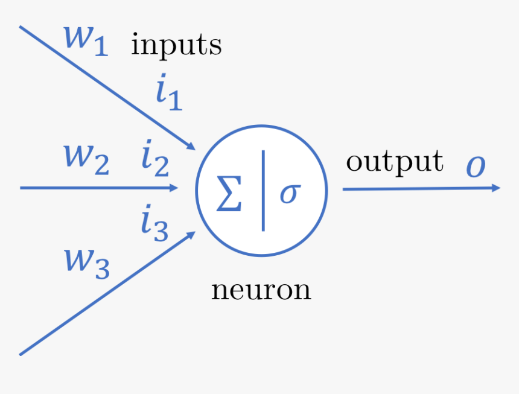

# AutogradEngine

In this repo, we build an auto gradient engine capable of backpropagation (just like TensorFlow or PyTorch). Please Enjoy!

### Software, Tools, and prerequisits

1. Access to Google Colab or some Jupyter Notebook.
2. Basic python programing.
3. Basic arithmetic & calculus knowledge.

### Intro: What is an AutoGrad Engine?

An autograd engine (as used in TensorFlow and PyTorch) is a class used to calculate the derivatives (Jacobian-Vector product) at every differentiable point in the system.

It does this by keeping a record graph of all operations performed on a gradient-enabled object and creating an acyclic graph called the dynamic computational graph.

In this repo, we focus on scalar-valued autograd engine for simplicity. This means we loose the parallelism that comes with tensor-values autograd engines like PyTorch and TensorFlow.

#### Example Usage

Let's take the mathematical equation below where the output _f(a,b,c)_ is a multi-variable function of the variables _a_, _b_, and _c_.

$$f(a,b,c) = a * b + c$$

The function _f(a,b,c)_ is said to be differentiable at all _a_ if it is continous and the derivitive as defined below exists at for all posible values _a_. A similar case with respect to _b_ and _c_.

$$\lim_{h \to 0} \frac{f(a+h,b,c) - f(a,b,c)}{h}$$

Using objects of the sample Value class below, we are able to maintain a computational graph of the state of our mathematical equation. This gives us the ability to calculate its derivitive with respect to each or its variables.

```python
class Value:
  """Class to wrap up our scalar values."""
  def __init__(self, data, _children=(), _op="", label=""):
    self.data = data
    self.grad = 0.0
    self.label = label
    self._prev = set(_children)
    self._op = _op

  def __add__(self, other):
    out = Value(self.data + other.data, _children=(self, other), _op='+')
    return out

  def __mul__(self, other):
    out = Value(self.data * other.data, _children=(self, other), _op='*')
    return out

  def __repr__(self):
    return f"Value(data={self.data}, label={self.label})"
```

Going with the values below:

```python
a = Value(2.0, label='a')
b = Value(3.0, label='b')
c = Value(10.0, label='c')
e = a*b; e.label = 'e'
d = e+c; d.label = 'd'
```

Basically _e = a \* b_ and _d = e + c_. Then calculating the derivitives/ gradient of the output $d$ (manually) with respect to each of its inputs and using the [Chain Rule](https://en.wikipedia.org/wiki/Chain_rule) when necessary as below.

```python
# Manually setting each derivitives (with Chain rule)
d.grad = 1 # dd/dd
e.grad = 1 # dd/de
c.grad = 1 # dd/dc
b.grad = a.data * e.grad # dd/da = de/da * dd/de
a.grad = b.data * e.grad # dd/db = de/db * dd/de
```

We would have a computational graph as below.


#### Building Neural Networks

Next we apply the same ideas above to build an entire neural network engine. but we first start with a single neuron.



A mathematical neuron is similar to a biological neuron but can be represented as a mathematical expression. Lets explore this in steps.

Supposed we had a function _f(x1, x2)_, where f is a multivariable function with two independent variables _x1_ and _x2_ which can take on any values within the real number systems (hence function _f_ is continous and differentiable).

For the sake of simplicity, we would force _x1_ and _x2_ to the values of _2.0_ and _0.0_ respectively to denote a single batch of 1 instance.

| **_x1_** | **_x2_** |
| -------- | -------- |
| 2.0      | 0.0      |

$$f(x1, x2) = \tanh\bigl(x1*w1 + x1*w1 + b\bigr) $$

```python
# inputs x1, x2
x1 = Value(2.0, label='x1')
x2 = Value(0.0, label='x2')
# weights w1, w2
w1 = Value(-3.0, label='w1')
w2 = Value(1.0, label='w2')
# bias of the neuron
b = Value(6.8813735870195432, label='b')
# x1*w1 + x2*w2 + b
x1w1 = x1*w1; x1w1.label='x1*w1'
x2w2 = x2*w2; x2w2.label='x2*w2'
x1w1x2w2 = x1w1 + x2w2; x1w1x2w2.label = 'x1w1 + x2w2'
n = x1w1x2w2 + b; n.label = 'n'
o = n.tanh(); o.label='o'
```

### How to Use This Repo

- Start with this `README.md` file.
- Move to the `Understanding_Derivatives.ipynb` file.
- Next the `AutoGrad.ipynb` file.
