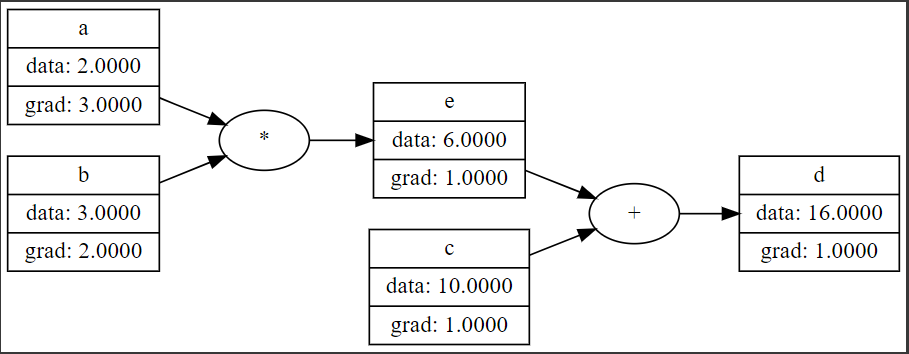

# AutogradEngine

In this repo, we build an auto gradient engine capable of backpropagation (just like TensorFlow or PyTorch). Please Enjoy!

### Software, Tools, and prerequisits

1. Access to Google Colab or some Jupyter Notebook.
2. Basic python programing.
3. Basic arithmetic & calculus knowledge

### Intro: What is an AutoGrad Engine?

An autograd engine (as used in TensorFlow and PyTorch) is a class used to calculate the derivatives (Jacobian-Vector product) at every differentiable point in the system.

It does this by keeping a record graph of all operations performed on a gradient-enabled object and creating an acyclic graph called the dynamic computational graph.

In this repo, we focus on scalar-valued autograd engine for simplicity. This means we loose the parallelism that comes with tensor-values autograd engines like PyTorch and TensorFlow.

#### Example Usage

Let's take the mathematical equation below where the output _f(a,b,c)_ is a multi-variable function of the variables _a_, _b_, and _c_.

$$f(a,b,c) = a * b + c$$

The function _f(a,b,c)_ is said to be differentiable at all _a_ if it is continous and the derivitive as defined below exists at for all posible values _a_. A similar case with respect to _b_ and _c_.

$$\lim_{h \to 0} \frac{f(a+h,b,c) - f(a,b,c)}{h}$$

Using objects of the sample Value class below, we are able to maintain a computational graph of the state of our mathematical equation. This gives us the ability to calculate its derivitive with respect to each or its variables.

```python
class Value:
  """Class to wrap up our scalar values."""
  def __init__(self, data, _children=(), _op="", label=""):
    self.data = data
    self.label = label
    self._prev = set(_children)
    self._op = _op

  def __add__(self, other):
    out = Value(self.data + other.data, _children=(self, other), _op='+')
    return out

  def __mul__(self, other):
    out = Value(self.data * other.data, _children=(self, other), _op='*')
    return out

  def __repr__(self):
    return f"Value(data={self.data}, label={self.label})"
```



#### How to Use This Repo

- Start with this `README.md` file.
- Move to the `Understanding_Derivatives.ipynb` file.
- Next the `AutoGrad.ipynb` file.
